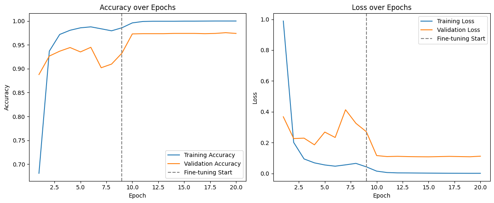
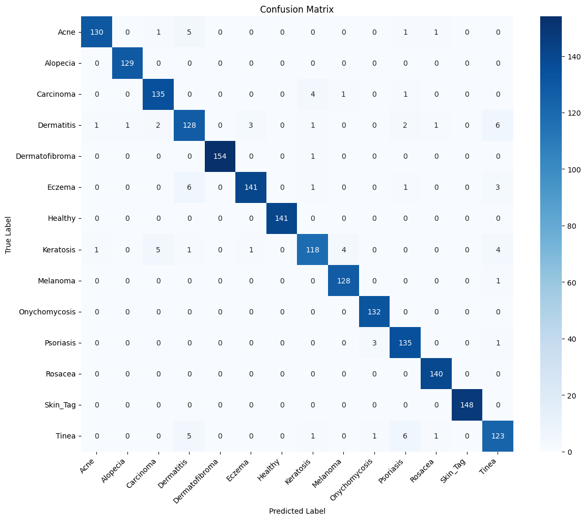

# Skin Disease Classifier using Transfer Learning (ResNet50 & MobileNetV2)

This project aims to empower individuals to **quickly identify common skin disorders** using deep learning. Born from a personal experience of living undiagnosed with psoriasis for over two years, this tool was built to bridge the gap between skin abnormalities and timely identification — especially for those without immediate access to dermatologists.

The model supports classification of **14 common skin conditions** including acne, eczema, psoriasis, rosacea, alopecia, and more.

---

## Dataset Preparation

- **Dataset Used**: The project uses a custom dataset made from the sd-198 dataset. We eliminated rare conditions and chose the ones people commonly face, and expanded the dataset using image augmentation. Thus we went from 198 classes and 6000 images to 14 classes and 9800 images.
- **Preprocessing Pipeline**:
  - Selected top 50 most frequent disease conditions.
  - Merged 52 sub-conditions into **13 major parent classes**.
  - Removed underrepresented classes to reduce class imbalance.
  - Added a **14th "Healthy" class** manually using verified healthy skin images.

- **Final Dataset**:
  - **2,186 original images** across 14 classes.
  - Expanded to **~9,800 images** via **custom image augmentation script**.

- **Augmentation Strategy**:
  - Targeted class balance by:
    - Sampling underrepresented class images.
    - Applying transformations: flipping, rotation, zoom, brightness, cropping, etc.
    - Repeating until each class had ~700 images.

---

## 🧪 Data Pipeline

- Built using `tf.data.Dataset`.
- Employed:
  - `AUTOTUNE` for optimized parallel processing.
  - Batched, shuffled, and prefetch-loaded datasets.
  - Custom augmentation pipeline using Keras layers.
  - Separated `train_ds` and `val_ds`.

---

## 🧠 Models & Architecture

### 🔹 MobileNetV2

- Lightweight and fast, designed for mobile and edge deployment.
- Architecture:
  - Depthwise separable convolutions
  - Bottleneck layers with 1x1 expansion & projection
  - Skip connections
- Pipeline:
  - Input → Augmentation → `mobilenet_v2.preprocess_input` → MobileNetV2 → GlobalAveragePooling → Dropout → Dense(14, softmax)
- Training:
  - Used `EarlyStopping` and `ModelCheckpoint`
  - Fine-tuned last **30 layers** after top-layer training


---

### 🔹 ResNet-50 (Final Model)

- Chosen as the **final model** due to high accuracy and robustness.
- Architecture:
  - 50-layer deep residual network
  - Skip connections (identity + projection)
  - Mitigates vanishing gradients and supports deep learning
- Pipeline:
  - Input → Augmentation → `resnet50.preprocess_input` → ResNet50 → GlobalAveragePooling → Dropout → Dense(14, softmax)
- Training:
  - Stage 1: Base model frozen
  - Stage 2: Last 50 layers unfrozen and fine-tuned with LR = 1e-5
- Performance:
  - **Train Accuracy**: 99.95%
  - **Validation Accuracy**: 97.4%



---

## 📊 Evaluation

- Evaluation Metrics:
  - Accuracy
  - F1-score
  - Precision & Recall
  - Confusion Matrix
  - Training & validation curves
- Insights:
  - Data augmentation boosted minority class performance.
  - Model generalized well with minimal overfitting.




---

## 🚀 Deployment

- The fine-tuned ResNet50 model is **hosted on Google Drive**.
- Deployed via **Streamlit**:
  - `app.py` written and versioned on GitHub.
  - Uses `@st.cache_resource` to cache model load.
  - User uploads image → model infers disease class in real-time.

- Files:
  - `app.py` — Streamlit frontend logic
  - `requirements.txt` — All dependencies
  - `model.h5` — Fine-tuned ResNet50 model file

---

## 🧠 Potential Improvements

- Add a **learning rate scheduler** (e.g. ReduceLROnPlateau, OneCycleLR) to MobileNetV2 training to handle plateaus.
- Integrate **GradCAM** visualizations for medical explainability and model trust.
- Train on higher resolution images to preserve critical skin details.
- Convert model to **ONNX** or **TensorFlow Lite** for mobile deployment.

---

## 💡 Why This Matters

Dermatological care is often **inaccessible, expensive, or delayed**. This tool helps provide **first-pass insight** using AI, encouraging earlier diagnosis and potentially life-changing outcomes — especially in underserved regions. With further clinical refinement, it may assist general physicians or function as a decision-support tool in resource-limited settings.

---

## Project Structure

```
skin-disease-classifier
├── app.py
├── requirements.txt
├── notebooks/
│ └── Skin_Disease_Classifier_Workbook.ipynb
├── figures/
│ ├── resnet50_results.png
│ └── mobilenetv2_results.png
└── README.md
```
It is not feasible to add the model or dataset here, since it exceeds Github's limit of 100 MBs, but you can view the dataset [here](https://drive.google.com/file/d/1o0_qCl57HUR4T6NZcxfuNXp8tugTRGNK/view?usp=sharing) and the model [here](https://drive.google.com/file/d/1N6F10miFe4DjOk1scbEhj9z062EPvdTO/view?usp=sharing).
---

## Author

**Muhammad Adam Umar**  
📍 [GitHub](https://github.com/MAdamUmar/)  
🔗 [LinkedIn](https://www.linkedin.com/in/muhammad-adam-umar-26baaa2b5/)  

---
